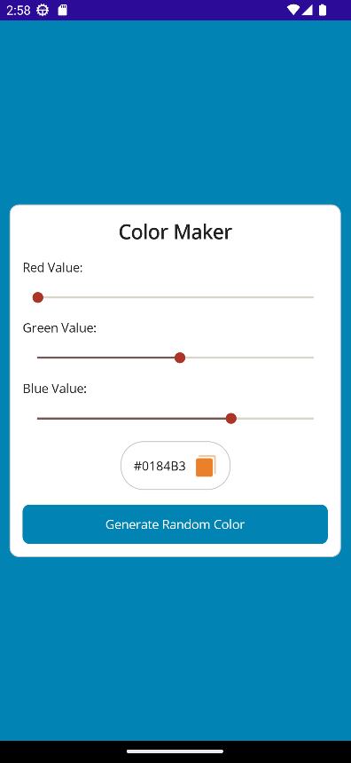

# Color Maker


Built using .NET MAUI
# Steps to clone this project

1. Clone Repository
    ```sh
    git clone https://lab.skynetinc.tech/WorldDrknss/Color.Maker.git
    ```

2. `cd` into the cloned repository
    ```sh
    cd Color.Maker
    ``` 
# Technologies 🔥

 - .NET
 - .NET MAUI
  
# Objective‼

 Learning the basics of XAML design and .NET MAUI.
# Features ✨
 - Color Picker
 - Display Hex values
 - Copy code to clipboard